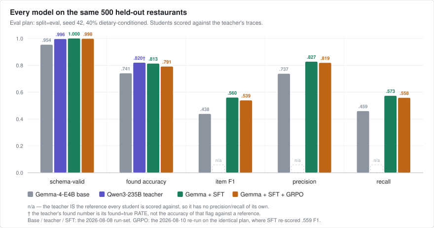
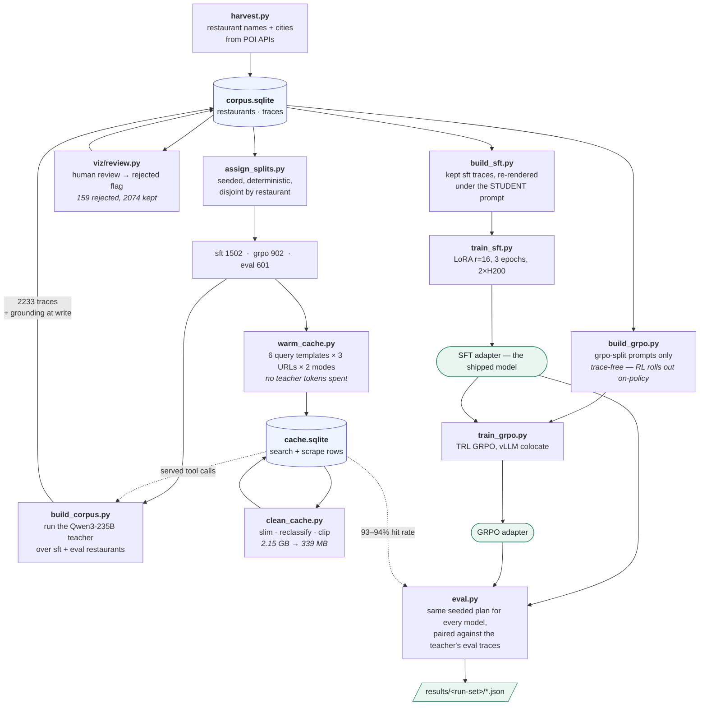
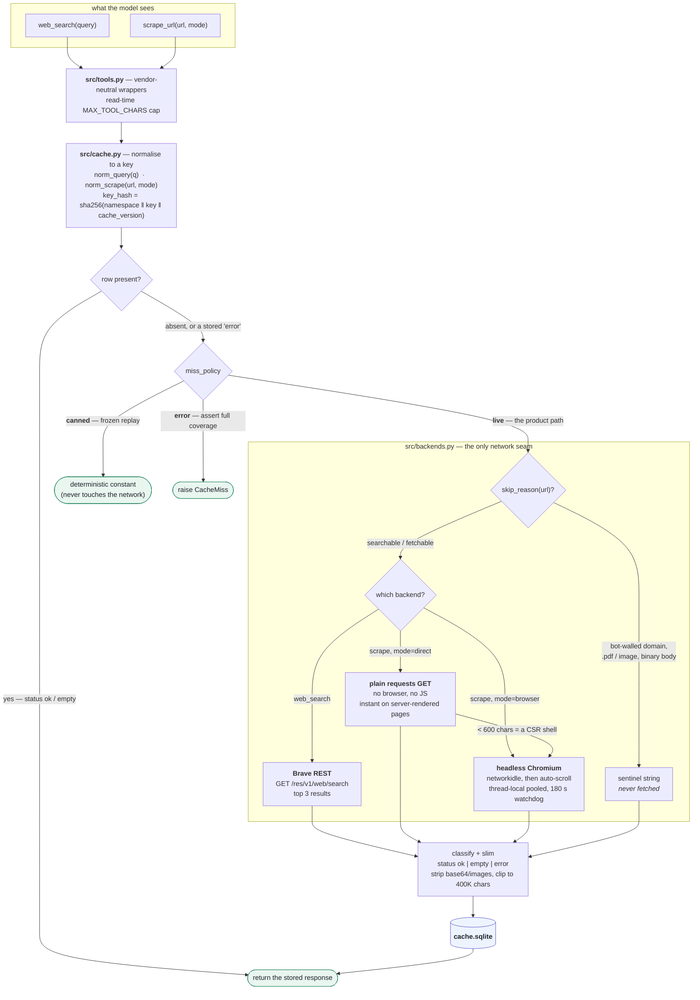
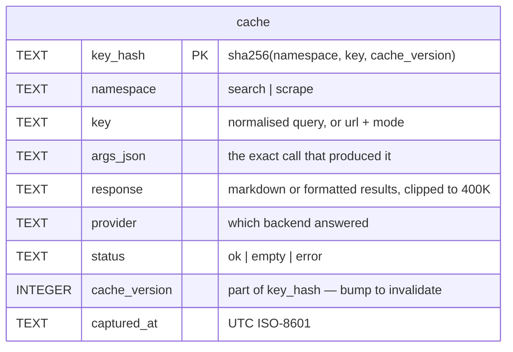
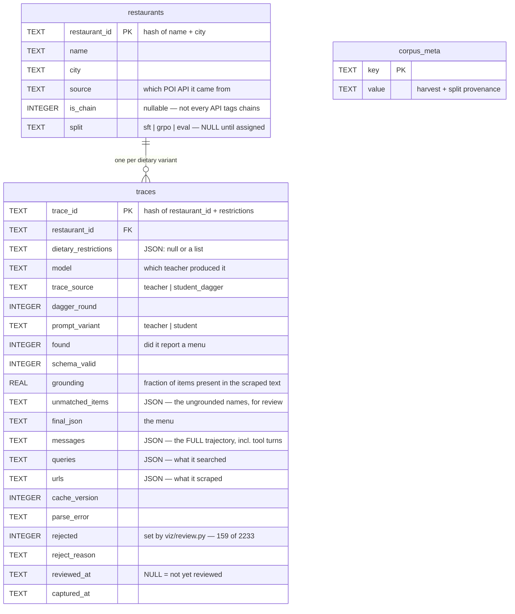

# small-model-finetuning

Fine-tune a small open-weight LLM (`google/gemma-4-E4B-it` — ~8B total, ~4B-effective text path) to take a **restaurant name** as input and return its **menu as structured JSON**, using **web search + scraping as inference-time tools**. The model doesn't memorize menus — it learns to *drive the tools* (search → scrape → extract) and emit the schema in [src/schema.py](src/schema.py).

The teacher is a self-hosted `Qwen/Qwen3-235B-A22B-Instruct-2507-FP8`; the student is Gemma-4-E4B-it, distilled from the teacher's trajectories under a **leaner prompt than the teacher saw** (context distillation), then evaluated against the teacher's own traces.

**This project is complete.** All five phases ran, everything is measured, and the results are below. For the engineering notes and the hard-won constraints behind every design choice, read [CLAUDE.md](CLAUDE.md) — it is the living source of truth. The narrative log of every run is [notes/experiments.md](notes/experiments.md).

## Results

500 held-out restaurants, one seeded plan (`--split eval --seed 42 --conditioned-frac 0.4`, 40% carrying a dietary restriction), every model on the same episodes with the same tool cache. Students are scored **paired** against the teacher's traces; the teacher is self-reported by construction (it *is* the reference).

| model | schema-valid | found acc | item F1 | precision | recall |
|---|---|---|---|---|---|
| Gemma-4-E4B base | 95.4% | 74.1% | 0.438 | 0.737 | 0.459 |
| **+ SFT — the shipped model** | **100.0%** | **81.3%** | **0.560** | **0.827** | **0.573** |
| + GRPO (50 steps on top of SFT) | 99.8% | 79.1% | 0.539 | 0.819 | 0.558 |
| Qwen3-235B teacher | 99.6% | 82.0% | — | — | — |



**SFT is the result.** +0.12 item F1 and +9 points of precision over the untrained base, schema-validity 95.4% → 100%, and — the sharpest gain — **calibration**: false-finds (claiming a menu for a restaurant that has none) drop 29 → 10. On *finding* the menu at all the 8B student essentially matches the 235B teacher (81.3% vs 82.0%) while running 2.2× faster. What it has not closed is **completeness**: precision 0.827 against recall 0.573 — when it answers it is right, it just returns a partial menu. That gap is what GRPO was supposed to fix.

**GRPO did not fix it.** Two runs, the second with the learning rate fixed (‖B‖ moved 13× further than run 1 in half the steps), produced a policy statistically indistinguishable from the SFT student — 71 wins / 75 losses per episode, all |t| < 1.96. The held-out probe stayed flat while `clipped_ratio` fell 0.32 → 0.20: the policy learned to *finish inside its budget*, not to build better menus. The standing diagnosis is the reward, not the optimizer — the grounding term pays for faithfulness to scraped evidence, which is maximized by reporting **fewer** items, while the real gap is recall. Training was called off there rather than scaled up. Full post-mortem in [notes/experiments.md](notes/experiments.md).

Machine-readable reports (per-model JSON + the generated table) are committed under [results/](results/); per-episode candidate traces are archived to S3. The chart above is generated from those reports — `uv run python scripts/analysis/make_charts.py` — so it cannot drift from them.

## Pipeline

| Phase | What it produced |
|---|---|
| 1. Agentic tool-call loop | `web_search` + `scrape_url` driving Gemma-4 through the Gemma-4 tool wire format |
| 2. Tool-call caching + teacher corpus | 2233 teacher traces (2074 kept after review) + a content-addressed SQLite cache |
| 3. SFT distillation | the shipped LoRA adapter — r=16, α=32, lr 2e-4, 3 epochs, ~35M trainable params |
| 4. GRPO RL | trace-free RL on a teacher-free reward — measured, null, stopped |
| 5. Eval | two scored run-sets, paired against the teacher's references |

Every stage after phase 1 runs on rented RunPod GPUs, driven by the phased bootstrap scripts in [scripts/infra/](scripts/infra/) ([eval_pod.sh](scripts/infra/eval_pod.sh), [grpo_pod.sh](scripts/infra/grpo_pod.sh)) — each is idempotent phase-by-phase and documented in its own header.

### Data flow

Restaurant names in, a trained-and-scored model out. Two SQLite files are the only durable state; every box is a script under [scripts/](scripts/).



The ordering constraint that matters: **`warm_cache` runs before `build_corpus`**, and the teacher runs before any student. The warm pre-pays the *student's* exploration distribution (not just the path the teacher happened to take), and the teacher's eval pass is what *creates* the reference traces every later score is measured against.

## How it works

- **The contract** ([src/schema.py](src/schema.py)) is the single source of truth. The prompt shows the model `SCHEMA_SNIPPET`; the eval validates against `MENU_SCHEMA`; the GRPO reward imports the same module. They cannot drift.
- **The tools** ([src/backends.py](src/backends.py)) are Brave search over REST plus a **local headless Chromium** — no scrape vendor, no API key. Local scraping buys determinism: a hosted scraper's server-side cache returned 351 chars cold and 15,069 warm for the same URL, which is a reproducibility hazard when the output becomes training data.
- **The cache** ([src/cache.py](src/cache.py)) is content-addressed SQLite with a pluggable miss policy (`live | canned | error`), so one code path serves SFT data collection, frozen GRPO rollouts, and the product.
- **Context distillation** ([src/prompts.py](src/prompts.py)): behavioral guidance that shapes *how* the agent works but not *what the right menu is* (scrape strategy, persistence, identity verification, source selection) is **teacher-only**. The student trains on the teacher's trajectories under a prompt that omits it, so the behavior lands in the weights instead of the context window. Anything target-defining — the schema, the food-only scope rule, the dietary restrictions — is identical across both variants, enforced by construction in `build_system_prompt`.
- **Serving** is vLLM. The Gemma student goes through raw `/v1/completions` with *our* chat template and *our* parser (vLLM ships no Gemma-4 tool-call parser), never the chat/tools path.

### The read-through tool cache

The model only ever sees two generically-named tools. Everything below `tools.py` — the cache, the provider, the fetch strategy — is invisible to it, which is why no vendor name leaks into the training data. A call is a **cache read first**; the network is only reached on a miss, and only when the policy allows it.



Three details carry most of the weight:

- **`status` is three-valued, and `empty` is not a failure.** A bot-walled domain returns a sentinel deliberately shorter than `MIN_CONTENT_CHARS`, so it classifies as `empty` — a **permanent** cached negative. An `error` row is a live-policy miss that gets re-fetched next pass; storing dead ends as `error` would re-pay a 30–45 s bot-wall timeout on every single run.
- **`cache_version` is part of the hash.** Bump it when the stored response *shape* changes and the whole cache invalidates cleanly, with no delete step.
- **The miss policy is what makes one code path serve three jobs**: `live` for corpus building and the product, `canned` for reproducible GRPO rollouts, `error` to assert a split is fully warmed before spending GPU time.



### The corpus database

`data/corpus.sqlite` is the single source of truth for the data layer: the restaurants, their split, every teacher trajectory, its grounding score, and the human review verdict — one file, three tables. v1 spread this across `restaurants.jsonl`, `splits.json`, `traces/*.json`, `reject_list.txt` and `grounding.json`, and they drifted.



`messages` holding the entire trajectory is what makes SFT re-rendering possible: `build_sft.py` replays the teacher's turns under the **student** prompt, so the distillation target is generated once and re-projected as often as the prompt changes.

## Layout

```
src/                     shared, model-agnostic modules
  schema.py              the menu JSON contract (single source of truth)
  prompts.py             system prompts (teacher/student variants)
  tools.py, backends.py  web_search (Brave) + scrape_url (local Chromium)
  cache.py               content-addressed SQLite tool-call cache
  corpus.py              data/corpus.sqlite access (the single data source of truth)
  grounding.py           menu-grounding scorer
  reward.py              the teacher-free GRPO reward (structure / found / grounding)
  eval_metrics.py        paired scoring vs the teacher's reference traces
  episodes.py, run_meta.py
  gemma/                 the fine-tuning target: model.py, agent.py, run_agent.py
  claude/                Claude Sonnet baseline on the same tools/prompts
  serving/               openai_agent.py — vLLM/OpenAI-compatible runner
scripts/
  corpus/                harvest, build_corpus, warm_cache, clean_cache, assign_splits
  datasets/              build_sft, build_grpo (corpus → training jsonl)
  train/                 train_sft, train_grpo, to_text_only
  eval/                  eval.py, summarize.py, dump_reference.py
  analysis/              analyze_queries, analyze_tool_chars, adapter_norms, make_charts
  infra/                 corpus_sync (S3), runpod_create, eval_pod.sh, grpo_pod.sh,
                         serve_teacher.sh, smoke_teacher
results/                 committed eval reports — the permanent record (see results/README.md)
notes/                   plans + the experiment log
tests/                   373 tests, no GPU or network required
viz/                     local FastAPI trace-review / data-cleaning UI
data/                    git-ignored; source of truth is S3 (see notes/S3_setup.md)
  corpus.sqlite          restaurants + sft/grpo/eval split + traces + grounding + reject flags
  cache.sqlite           tool-call cache
```

## Setup

Package manager is **uv** (never bare `pip`). Examples assume bash.

```bash
uv sync                              # reproduce the env from pyproject.toml + uv.lock
uv run playwright install chromium   # scrape backend
cp .env.example .env                 # then fill in BRAVE_API_KEY, HF_TOKEN, etc.
huggingface-cli login                # google/gemma-4-E4B-it is gated
```

`.env` holds `BRAVE_API_KEY` (search; scrape needs no key), `HF_TOKEN` (gated model), the Claude baseline's `ANTHROPIC_API_KEY`, `WANDB_API_KEY`, and the S3 config (`S3_BUCKET`/`S3_PREFIX`/`AWS_*`). See [.env.example](.env.example).

```bash
uv run pytest                        # 373 tests, ~3 min, no GPU or network
```

## Running the stages

```bash
# One episode through the agentic loop (dev box defaults to 4-bit — see CLAUDE.md)
uv run python main.py

# Claude baseline on the same tools/prompt/schema
uv run python src/claude/run_claude.py

# Sync data artifacts with S3 (corpus, cache, datasets, models)
uv run python scripts/infra/corpus_sync.py pull
uv run python scripts/infra/corpus_sync.py push --only sft

# Build the SFT dataset, then LoRA-train (2×H200 pod — see notes/runpod_sft.md)
uv run python scripts/datasets/build_sft.py
uv run python scripts/train/train_sft.py --dry-run     # cheap gate before GPU
accelerate launch --config_file configs/accelerate_ddp.yaml scripts/train/train_sft.py

# Eval a served checkpoint against the teacher's references
uv run python scripts/eval/eval.py --model gemma --gemma-vllm-base-url http://... \
    --split eval --seed 42 --limit 500 --conditioned-frac 0.4 --json report.json
uv run python scripts/eval/summarize.py results/<run-set> -o results/<run-set>/README.md

# Review / clean traces locally (writes the reject flags in corpus.sqlite)
uv run uvicorn viz.review:app --host 127.0.0.1 --port 8001
```

Full multi-GPU runs are driven end to end by the pod scripts rather than by hand:

```bash
bash scripts/infra/eval_pod.sh setup   # then serve-teacher, smoke, run-teacher, ...
bash scripts/infra/grpo_pod.sh setup   # then prep-model, smoke, train, ...
```

## If you pick this up again

The cheapest open question is the one GRPO left on the table: **the reward asks for precision and the model needs recall.** Re-weight [src/reward.py](src/reward.py) for menu completeness before spending another GPU-hour on more steps — the run-2 evidence says more of the same reward cannot close the gap. Everything needed to test that is already built and warmed: the `grpo` split's cache is complete (902/902 restaurants), the harness is [scripts/infra/grpo_pod.sh](scripts/infra/grpo_pod.sh), and a 50-step run is a few hundred dollars.

## Hardware note

The dev box is a single 24 GB GPU with limited host RAM, so `main.py` defaults to 4-bit loading and the code pins `sdpa` attention (FlashAttention cannot serve Gemma-4's `head_dim=512` global layers, on any GPU). Real training and serving happen on rented multi-GPU pods, where the binding constraints are entirely different — vLLM handles `head_dim=512` natively and needs none of the HF-path workarounds. Both sets of constraints, and why they differ, are documented in [CLAUDE.md](CLAUDE.md).
